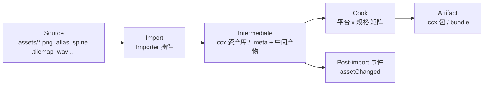

# asset-spec — 资产系统规格（2D-first：三阶段流水线 + AssetDB 服务）

> 配套：ADR-003、ADR-006 · 依赖：services-spec（AssetService）、engine-spec §5（反射 schema）
> **v0.2：3D 资产导入链（gltf/fbx 网格、骨骼 3D、材质变体）移出范围。**

---

## 1. 总则

1. **Asset Pipeline 脱离 Editor**：导入与 Cook 是服务（daemon 或进程内），CLI/CI/MCP/Editor 都是客户端（铁律 3/4/9）。
2. **Asset Database 是服务**：watch 文件系统、维护索引、派发事件；不存在"编辑器开着才能导入"。

## 2. 三阶段流水线



### 2.1 阶段职责

| 阶段 | 输入 | 输出 | 幂等/缓存键 |
| --- | --- | --- | --- |
| Import | 源文件字节 + importer 参数 | Intermediate 资产（{uuid, type, subAssets[], deps[], preview?, json/binary 中间态}） | (fileHash, importerVersion, params) |
| Cook | Intermediate + platform + variant | Artifact 段（gpu 资源/压缩纹理/图集烘焙/LZ4 bundle） | (intermediateHash, platformKey, optionsHash) |
| Package | Artifact 集 + 场景 + 脚本产物 | 可发布包（bundle 目录/tar/小游戏分包结构） | (artifactHashes + 场景图) |

- **项目目录不动**：写 `assets/` 之外的 `library/`（中间态，可删可重建）与 `build/`（产物）；`assets/**/*.meta` 只存 uuid/params（可入库）。
- 缓存主键全部内容寻址（content hash），git 友好；重建时间目标：万级资产全量 rebuild < 5 min（桌面）。

### 2.2 Importer 插件协议（TS）

```ts
export interface IImporter {
  id: string;                                    // "ccx.atlas" 之类
  accepts: { ext: string[], mime?: string[] }[];
  outputs: string[];                             // 中间资产类型 "ccx.Sprite","ccx.AtlasedTexture"
  async import(ctx: ImportCtx): Promise<IntermediateResult[]>;
  async cook(ctx: CookCtx, target: PlatformKey): Promise<ArtifactResult[]>;  // 可省略（默认直通）
  preview?: (ctx) => Promise<Buffer | null>;     // 缩略图（独立于 GUI，产出图片字节）
}
```

- 内置 importer（v0.2 全 2D）：**image**（png/jpg/webp/astc 直通；纹理压缩参数）、**atlas**（图集打包：TexturePacker/自制 JSON/二进制）、**sprite**（单图→sprite 资产）、**spine**（.json/.skel 骨骼 2D）、**dragonbones**、**tilemap**（tsx/自制 JSON 地图）、**font**（ttf/otf/fnt 位图字体）、**audio**（wav/ogg/mp3 → 平台编解码）、**video**、**scene/prefab**（ADR-003 JSON 直通）、**material/shader**（文本资产直通）、**particle2d**（粒子参数资产）。
- 优先级链：扩展名 + 文件头探测；同名 importer 冲突 = 队列报错，人工裁决（写 `.meta`）。

### 2.3 中间资产形态

- JSON 类（scene/prefab/material/动画状态机/粒子参数）：**Intermediate = 规范化后的 ADR-003 JSON/配套 schema**（编辑器与运行时同一份）。
- 位图类（png/jpg/webp）：Intermediate = 源引用 + 已解析文件头（尺寸/格式/是否带 alpha）+ 预生成预览。
- 图集类：Intermediate = 子图元数据表（rect/rotated/九宫格切片/padding）+ 合图引用；**图集烘焙放 Cook 阶段**（平台格式差异在 Cook 收敛）。
- 骨骼 2D：Intermediate = 骨架 JSON 规范化 + 图集引用；Cook 输出顶点权重表与图集裁切。
- 每个资产：`uuid`（v5 = hash(相对路径, importerId)，路径迁移不变）+ 依赖边 + 版本。

## 3. AssetDB 服务

### 3.1 数据

- 索引表存 `library/db.json`（SQLite 演进 M2 再定）：`uuid → {path, type, importer, paramsHash, intermediateHash, subAssets}`。
- 变更检测：文件系统 watch（原生 ReadDirectoryChangesW/inotify/FSEvents；Web 服务端轮询兜底）+ 启动增量全量扫。

### 3.2 事件流（AssetService 对外契约）

```json
{ "service": "asset", "event": "assetChanged",
  "data": { "uuid": "…", "change": "created|modified|deleted|reimported|cooked", "reason": "fs|x" } }
```

- 订阅按过滤器：`{ types: ["ccx.Sprite"], uuids: [...] }`；事件带 seq 支持断点续传（客户端丢事件 = 全量重扫兜底）。

### 3.3 Headless 队列

- 所有导入/cook 是任务队列（优先级：用户操作 > 编辑器预览 > CI 全量）；可暂停/取消/重排。
- 失败不阻塞：失败资产进待办列表（`AssetStatus` 事件），编辑器红点提示，AI 可查询 `asset.report_status`。

## 4. Cook 矩阵（2D，示例）

| 平台键 | 纹理默认 | 图集 | 音频 | 备注 |
| --- | --- | --- | --- | --- |
| web-desktop | png/webp 直通 | 原样 | ogg/mp3 | webp 由 importer 参数 |
| web-mobile | webp 主选 | 原样 | ogg/mp3 | |
| android | astc 4x4 主选，etc2 保底 | 按通道压缩 | ogg | 低端机走 etc2 |
| ios | astc 4x4 | 同左 | m4a/aac | |
| minigame-* | etc2/astc 按渠道表 | 同左 | m4a | 包体预算 4MB 主包优先 |
| windows/mac | 直通（BC 可选） | 原样 | ogg | 桌面包体不敏感 |

- 压缩执行器：原生 worker（astcenc 等，MIT 许可可选）+ 服务端 CPU 池；进度事件 `cookProgress`。
- Cook 去重：同 intermediate 同平台同参数 = 同 artifact hash（多 bundle 共享）。
- **图集烘焙在 Cook**：同 intermediate 在不同平台可产出不同合图（压缩影响图集大小），运行时透明。

## 5. 与 Scene/Prefab 的关系

- SceneService 打开场景 = 加载 Intermediate 场景 JSON（ADR-003）→ 校验 schema → 构建 ECS World。
- 资产引用：`AssetRef`（uuid+sub+type）→ AssetService 解析 runtime 句柄（spot + 异步加载）。
- 预制体覆盖（ADR-003 §4.2）在 SceneService 层应用，底层 ECS 不感知。

## 6. 目录布局（项目模板）

```text
MyGame/
├── assets/           源资产（入库）
├── assets/*.meta     uuid/params（入库）
├── library/          中间态（不入库，可删）
├── build/            发布产物（不入库）
├── scenes/           场景 JSON（assets 内或以独立目录入库）
├── scripts/          游戏脚本 (TS)
├── packages/         项目级插件（importer/builder/inspector）
└── ccx.project.json  项目描述（入口、默认场景、平台配置、环境变量）
```

## 7. 非功能指标（M2 gate，2D）

| 指标 | 预算 |
| --- | --- |
| 1000 张精灵图/100 组图集导入 | < 10 s（并发 8 worker） |
| 10 万资产库索引启动 | < 3 s（增量） |
| 图集烘焙 2048²×50 张 | < 30 s 总量（含压缩） |
| Cook 并行度 | 核数-2 混合池；内存 < 2 GB |
| 事件丢失容错 | 客户端全量重扫恢复 |

## 8. 明确不做（v0.2 范围外）

- **3D 资产导入链**：gltf/fbx 网格、骨骼 3D、蒙皮、材质 PBR 变体 —— 全部不做。
- 不做 DAM（多人协作/权限/在线评审）—— M5 评审。
- 不做"资产即代码"；脚本属于项目代码管线（ADR-004）。
- 不继承 Creator .meta 私有字段；迁移器 M5 转换（2D 项目）。
