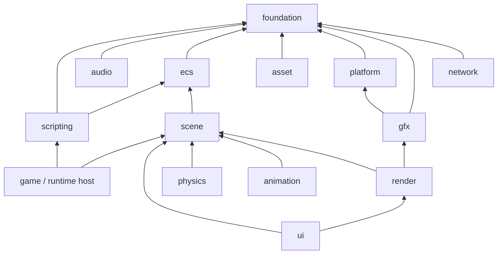

# engine-spec — 引擎核心规格（2D-first，可开工版）

> 配套：ADR-001/002/003/004 · **v0.2：范围收敛为 2D-first（用户裁切：不需要 3D 能力）**
> 本文件是引擎侧唯一事实来源。所有 API 以本文件为准。

---

## 1. 模块树与依赖方向

```text
engine/                          (C++20，CMake 子项目，均可裁剪)
├── foundation/                 容器/数学/内存/Job/反射/序列化
│   ├── containers/             vector_map, flat_set, smallbuf…
│   ├── math/                   Vec2/Vec3/Quat/Mat/Color (SIMD 加速，无外部依赖)
│   ├── memory/                 Arena, Pool, TLS allocator
│   ├── job/                    JobSystem: task 图 + worker 池 + fiber 可选
│   ├── reflection/             类型注册 + 元数据 + schema 生成
│   └── serialization/          JSON/binary 编解码 + 迁移框架
├── ecs/                        World/Entity/Archetype/Query/System/CommandBuffer
├── scene/                      Transform 树、层级、2D 排序层（layer/sortingOrder）、场景对象视图、Prefab runtime
├── gfx/                        RHI（见 renderer-spec §2）
├── render/                     RenderGraph + Pipeline + RenderScene（2D 内容管线，见 renderer-spec）
├── animation/                  2D 动画：曲线/精灵帧/Spine/DragonBones 桥（热路径 C++；状态机数据走 ECS）
├── physics/                    bridge 至 Box2D（2D；抽象 IPhysicsWorld2D）
├── audio/                      bridge 至 vendor 后端（抽象 IAudioBackend）
├── ui/                         UI 树（实体+UI 组件）、布局、控件（渲染走 render 的 UI pass）
├── input/                      统一输入事件源 (经 platform adapter)
├── asset/                      runtime 资产句柄、引用解析、异步加载
├── scripting/                  宿主(V8/JSC) + IDL 绑定 + 热重载
├── network/                    socket/http/webrtc 抽象 + 同步通道
└── platform/                   能力模型 + adapter 注册表 + vendor 封装（见 platform-spec）
```

依赖方向（只允许向下，同层禁止环）：



**依赖纪律**（CI 用 `layered_imports` lint 强制）：

- `engine/*` 一律不得 include `editor/`、`services/`、`cli`、`mcp` 任何头文件。
- 只允许向上依赖"根"（app/）；库代码（无 main）不允许依赖 app。
- 同层之间只允许指定方向（如 render→scene 可以，scene→render 不行）。

## 2. 模块裁剪（"允许完全不装"）

- 每个 CMake 子项目 = 一个 `ccx_<name>` 库；feature 由 `CCX_BUILD_<NAME>` 开关控制。
- 标准 2D 游戏项目：foundation + ecs + scene + gfx + render + ui + input + audio + asset + scripting + physics(可选) + animation(可选)。
- 服务器（2D 联机）：foundation + ecs + network + serialization + scripting(可选)。
- 工具头：foundation + reflection + serialization（无 GPU 依赖）。
- 链接期裁剪用"库粒度 + 链接脚本去符号"两层，禁止"运行时功能降级开关"蔓延。

## 3. ECS 规格（ADR-002 落地）

### 3.1 核心类型

```cpp
namespace ccx {
struct Entity { uint32_t index; uint32_t version; };

class World {
 public:
  Entity  create(const std::string_view name = {});
  void    destroy(Entity e);
  Entity  clone(Entity e);                 // 深克隆子树（含组件）
  bool    valid(Entity e) const;

  template <class C> bool        has(Entity e) const;
  template <class C> C&           get(Entity e);
  template <class C> const C&     get(Entity e) const;
  template <class C, class... A> C& add(Entity e, A&&... args);
  template <class C> void         remove(Entity e);
  void setParent(Entity e, Entity p);      // p==null → 根

  Query      query(const Signature& sig);  // 签名缓存
};
}
```

### 3.2 Archetype/Chunk 布局

- **Archetype = 组件类型 id 有序集合**；每 archetype 一组 `Chunk`（SoA，默认 16 KiB）。
- 组件默认**平凡可 memmove**（`kRelocatable`）；非平凡类型（string/vector）标 `kTagged` 走指针区。
- 增删组件 = archetype 迁移：新 chunk + `memmove` + 源收缩（墓碑延迟清理由 `DefragmentSystem` 低频执行）。

### 3.3 Query 与迭代

```cpp
for (auto [e, tf, vel] : world.query(Signature{&Transform::Type, &Velocity::Type})) {
  tf.position += vel.v * dt;
}
world.par_for(Signature{&Transform::Type}, [&](Entity e, const Transform& tf) { ... });

Signature{&Transform::Type}.with<Sprite>().without<Disabled>();
```

- Query 首次使用即缓存，订阅世界变异事件增量更新。
- 迭代期间写必须经可写句柄或 CommandBuffer；调度层运行期校验（debug 全查，release 仅 `CCX_ECS_CHECKS`）。

### 3.4 System 调度（JobSystem）

```cpp
enum class Stage { PreSimulation, Simulation, Physics, Animation, PostAnimation, Render, PostFrame };
```

- 系统声明：stage、`before[]`/`after[]`、`reads[]/`writes[]`（并行冲突检测）。
- 每帧构建 system 依赖图：无冲突系统分给不同 worker（`job::TaskGraph`，worker = 核数-1，移动端可关）。
- 物理固定步长（60Hz tick）与渲染帧解耦；动画采样紧贴渲染帧（`PostAnimation`）。
- 禁止：系统内 sleep/spin/锁 IO（lint）；系统无状态（持久状态进组件或 world 单例实体）。

### 3.5 CommandBuffer（写入通道）

```cpp
class CommandBuffer {
  void createEntity(Entity& out);
  void destroyEntity(Entity e);
  void addComponent(Entity e, TypeId t, const void* initData);
  void removeComponent(Entity e, TypeId t);
  void setParent(Entity e, Entity p);
  void setComponentData(Entity e, TypeId t, const void* data);   // 序列化直入
  void apply(World& w);                                          // 阶段末尾批量执行
};
```

- 编辑器外部写入（SceneService、AI）一律构造 CommandBuffer/命令对象，保证回滚与重放。
- 未 apply 的 buffer 可整体丢弃（事务语义）。

### 3.6 bridge 组件规则

```cpp
struct PhysicsBody2D { uint64_t handle; uint64_t syncBits; Vec2 pendingImpulse; };
struct Renderable    { Handle<RenderNode> node; uint8_t dirty; };
struct AudioSource   { uint64_t handle; uint8_t dirty; };
```

- lint：bridge 组件禁止虚函数、禁止业务方法体 >20 行、禁止持容器。
- 同步规则：PhysicsSystem 每 tick 回写 Transform；RenderScene 每渲染帧从 Transform+Renderable 增量重建（脏集）；音频/UI 类似。

### 3.7 性能预算（M1 出口 gate，2D 基准）

| 指标 | 预算 |
| --- | --- |
| 实体创建/销毁 | ≥ 1M/s（批量） |
| 查询迭代（10 万 Transform 只读） | < 2 ms（桌面）/ < 6 ms（移动中档） |
| 无渲染空世界 tick | < 0.5 ms |
| 内存 | 空 entity 16 B；Transform 64 B；16 KiB chunk 开销 < 5% |
| 10 万动态精灵帧推进（变换写 + 脏集） | < 1.5 ms（移动）+ 渲染预算见 renderer-spec §6 |

## 4. Transform 树、层级与 2D 排序

- 内部：`Transform`（local pos/rot(z)/scale）+ `Hierarchy`（parent/firstChild/nextSibling，数组化）+ 世界矩阵缓存（脏传播位集）。
- **2D 排序**：`SortingGroup` 组件承载 `layer`（uint8）+ `sortingOrder`（int16）；渲染排序键 = layer→sortingOrder→批键→插入序（renderer-spec §3.2）。
- `HierarchyView` 只读视图供编辑器/动画/UI/预制体使用；写数据一律走组件 API/CommandBuffer。
- 多场景实例 = 多 World（共享资产注册表）。

## 5. 反射系统

### 5.1 注册 DSL（C++，宏 + traits，M0 可用；Clang 工具化列为 D4）

```cpp
CCX_TYPE(Health,
  (CCX_PROP(&Health::max, "max", { .rangeMin = 0.0f, .rangeMax = 1000.0f, .ui = "slider" })),
  (CCX_PROP(&Health::current, "current", {})));

// 注意：每个 CCX_PROP(...) 必须整体包一层括号（泛型宏的 __VA_ARGS__
// 会在花括号内的逗号处切分参数；CCX_PROP 本身为可变参，见 ccx_type.h）。
// 成员类型自动推断 TypeKind（float/int/bool/string/Vec2/Color/对象），
// 嵌套对象字段要求其类型已先 CCX_TYPE 注册。
```

- 生成：type id（稳定字符串）、字段表（名/偏移/类型/元数据）、默认值构造、序列化入口、JSON Schema 降级输出。
- 元数据（v1）：`range/clamp/step`、`ui: slider|color|assetRef|enum|vectorN`、`assetType`、`serialize: skip|flatten`、`typeHint`、`readOnly`、`deprecated`。

### 5.2 类型字典与 schema

- TypeRegistry：`typeId → TypeInfo`；启动时静态注册。
- `TypeInfo::toJsonSchema()`：Inspector、MCP 参数校验、二进制编解码共用同一来源（一处 schema，三处消费）。
- 版本化：`schema` 字段 + `migrators[]`，场景文件头声明 schema 版本。

### 5.3 编辑器驱动

- Inspector 由 schema 生成；第三方组件（TS 或 C++ 插件）注册即得 Inspector，零额外 UI 代码。

## 6. 序列化（ADR-003 落地）

- **JSON 编解码**：组件由 schema 驱动；引用统一 `"uuid:sub:type"`；浮点保留 6 位有效；数组/矩阵平铺。
- **binary（.cscene）**：header + archetype 段 + name 表 + 引用表；加载 O(1) 映射；CRC + LZ4 可选。
- **round-trip 测试**：任意合法世界 JSON→binary→JSON 全等（CI 必跑）；格式变更 = 迁移器新增前置用例。
- 场景文件 = World 快照 + 资产引用表 + 编辑器辅助段（`meta`，只允许放非游戏数据）。

## 7. 脚本系统（ADR-004 落地）

- 宿主选配：`CCX_SCRIPT_V8`（桌面/原生）、`CCX_SCRIPT_JSC`（小游戏平台适配）、`CCX_SCRIPT_BROWSER`（Web 内嵌浏览器 VM）。
- IDL → 生成器（`tools/bindgen`）：输入 `.idl`，输出 napi 绑定源码 + `ccx.d.ts` + JSON Schema。
- TS 组件/系统注解（`@ccxComponent/@ccxSystem`）编译期产出 schema 与注册表。
- 热重载协议：脚本模块资源 sha 监听 → 新 VM 上下文加载新模块 → 系统注册表替换 → ECS 数据不动；失败回滚旧模块。
- 性能红线：**每帧 >50 次 C++→JS 跨边界调用需要评审**（防止把渲染/物理逐对象搬去 TS）。

## 8. cc4-compat 兼容层与迁移

- `compat/cc4/`：`cc.Node/cc.Component/cc.Scene/cc.systemEvent` 运行时视图，底层驱动 ECS（Node=facade、Component=桥接注册表）。
- 用途：存量 Creator 项目的**运行时兼容**（不迁移可跑），与新 API 同进程共存。
- 迁移器（M5）：Creator .scene/.prefab/.meta/项目结构 → ADR-003 v1；组件名映射 + 属性映射 + 脚本引用重写（**2D 项目为主**；Creator 3D 项目不在迁移承诺内）。
- 兼容层独立发布，不进引擎核心目录。

## 9. 构建与质量门

- CMake presets：`desktop-dbg/release`、`android`、`ios`、`web-wasm`、`server`；`generated/`（bindgen 输出）先于编译。
- 编译器：MSVC 2022 / Clang 17+ / GCC 13+；`-Wall -Wextra -Werror` + clang-tidy + include-what-you-use（CI）。
- 测试：单元+集成+架构 lint；bench 注册进 CI 看板；fuzz：序列化/场景解析/IDL 解析（OSS-Fuzz 迁移）。
- 门禁：依赖方向 lint、vendor patch 校验、schema round-trip、符号裁剪快照，全进 PR 检查。

## 10. 明确不做（v0.2 范围外）

- **3D 内容管线**（网格渲染/PBR/光照/阴影/延迟/GPU-driven/骨骼 3D）：不做（renderer-spec 范围声明）。
- 不做多线程脚本运行（TS 单线程，Worker 边界 M4+）。
- 不做运行时插件热加载 ABI（插件 = 编译期库或脚本模块）。
- 不做 D3D12 后端、不做光线追踪 / 虚拟纹理（mip 流送保留）。
