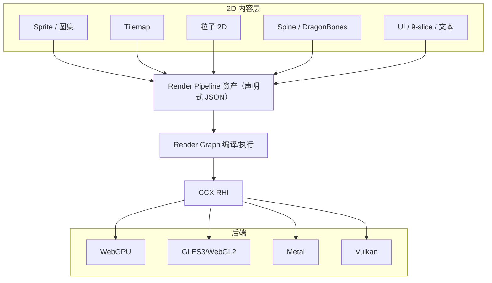

# renderer-spec — 渲染器规格（2D-first：RHI / Render Graph / Pipeline + 2D 内容管线）

> 配套：ADR-001（C++）、ADR-005（后端矩阵） · 依赖：engine-spec §1（gfx/render 模块）
> **v0.2 范围声明：CCX 不做 3D 能力。** 3D 内容管线（网格渲染/PBR/光照/阴影/延迟渲染/GPU-driven/骨骼 3D）全部移出 v1 范围；渲染器抽象层（RHI/Render Graph/Pipeline）保持维度无关，未来若开放 3D，走独立 Pipeline 插件评审，不回流本规格默认路径。

---

## 1. 分层总览



**边界铁律**：

- RHI **不认识**场景/相机/精灵/图集（只有 buffer/texture/command/pipeline state）。违反即 3 年后变回老 gfx。
- RenderGraph 只做"图"：pass 声明、资源生命周期、执行顺序；不认识"这是一张血条"。
- Pipeline 是唯一认识游戏语义的层，且它是**资产**（数据驱动），不是代码。
- **维度无关性**：RHI/RG/Pipeline 的抽象不假设 2D 或 3D（不出现"投影矩阵语义""深度 prepass"等 3D 专用概念内置）；本版本只交付 2D 内容管线。

## 2. RHI 规格（维度无关，与 v0.1 一致）

### 2.1 资源

```cpp
namespace ccx::gfx {
struct BufferDesc   { uint32_t size; Usage usage; Memory memory; Flags flags; };
struct TextureDesc  { Format format; Extent2D size; uint32_t mipLevels, samples, layers;
                      Usage usage; /* RENDER_TARGET | SAMPLED | STORAGE | UNIFORM */ };
struct SamplerDesc  { Filter min/mag; MipFilter; Wrap u/v/w; CompareOp; };
struct BindGroupLayout, PipelineLayout;   // 描述符布局（bindless 就绪：数组槽）
struct RenderPipelineDesc  { ShaderStages; BlendState; DepthStencilState; RasterState;
                             PrimitiveTopology; VertexLayout; };
}

class Device {
  Buffer*   createBuffer(const BufferDesc&);
  Texture*  createTexture(const TextureDesc&);
  Sampler*  createSampler(const SamplerDesc&);
  void      destroy(Resource*);
  CommandQueue& queue();          // 主队列（可选 compute/transfer 队列经 capability）
  Swapchain* createSwapchain(const WindowHandle&, const SwapchainDesc&);
  void      waitIdle();
};
```

- 资源三态：`Immediate` / `Deferred`（上传后有效）/ `Streaming`（多帧上传队列，纹理流送用）。
- 句柄化：所有资源经 `Handle<T>` 托管；debug 模式资源名/创建栈可查。

### 2.2 命令与同步

```cpp
class CommandEncoder {
  void beginRenderPass(const RenderTargets&, const ClearValues*);
  void setPipeline(PipelineLayoutHandle, PipelineHandle);
  void setBindGroup(uint32_t index, BindGroupHandle);
  void setPushConstants(const void* data, uint32_t size);
  void draw(uint32_t vertexCount, uint32_t instanceCount, uint32_t firstVertex, uint32_t firstInstance);
  void drawIndexed(const IndexBufferView&, ...);
  void drawIndirect(BufferHandle args, ...);            // 预留：粒子条带化/大规模实例未来用，v1 主路径不依赖
  void endRenderPass();
  void copyBufferToTexture(...);
  void pipelineBarrier(PipelineStage src, PipelineStage dst, const ResourceBarriers&);
};

class Fence; class Semaphore;   // 帧同步：有限帧在途（max frames in flight ≤ 3）
```

- 编码器一次性（encoder-per-pass），与 Render Graph pass 生命周期一一对应。
- 后端 map：Vulkan/Metal 直接对齐；WebGPU 同语义（pass 边界 + 用途声明）；GLES3/WebGL2 无显式 barrier（RHI 层维护转换状态，见 §2.4）。

### 2.3 后端矩阵（2D 视角）

| 后端 | 平台 | 时间线 | 说明 |
| --- | --- | --- | --- |
| WebGPU (native) | Win/macOS 桌面（2026-08-29 起 Linux 移除） | M1 | 桌面默认 |
| WebGPU (web) | 浏览器 | M1 | 同一套代码 |
| GLES3 / WebGL2 | Android 全档 / 低端移动 / Web fallback | M2 | **移动端默认主后端**（2D 预算富余） |
| Metal | iOS/macOS | M2 | iOS 唯一后端 |
| Vulkan | Android 高端 | M2 | 可选加速，非必需 |
| D3D12 | — | 不做 | 2D 无动机（ADR-005） |

### 2.4 GLES3/WebGL2 降级策略

- 无间接绘制：RHI 层 CPU 回读 args batch（能力位 `indirectDraw` 为假时自动切换提交路径）。
- 实例化不支持的极端老设备：RHI 展开实例为普通绘制（上限告警）。
- 所有降级由能力位驱动，游戏代码零改动（铁律 8）。

## 3. Render Graph 规格

### 3.1 模型（与 v0.1 一致）

- `RenderPass`：输入资源（`texture: {format, size, load, clear}`）、输出资源、着色器阶段集、绘制提交（场景内容经 `RenderView` 注入）。
- 编译器：别名分析（transient 合并）、自动 barrier（RHI 平掉后端差异）、pass 重排序（不改变语义）、帧间复用资源池。
- 外部资源导入：swapchain 图像、外部纹理（视频/相机）以 `ExternalResource` 节点接入。

```cpp
class RenderGraph {
  RenderPassBuilder pass(const PassKey&, const PassDef&);
  void   addResource(const ResourceRef&, const TransientDesc&);
  ExecutableView compile(const Device&);    // 编译产物可缓存复用
  void   execute(CommandEncoder&, const ExecutableView&);
};
```

### 3.2 默认 pass 链（2D）

```text
[World 层]    SpriteBatch(同图集同材质合批) → TilemapChunks → Particle2D(add/alpha) → SpineBatch
[Light 层(可选)] SpriteLight2D(additive，简单光源精灵：点光/聚光贴花)
[UI 层]      CanvasBatch(9-slice/文本/控件) → UI 特效(可选)
[PostFX]     ColorGrading / Vignette（资产配置，默认关）
[Present]
```

- **相机 = 图层集合**：每个相机一个 RenderView（正交投影 + 图层掩码 + 排序基准）；多相机 = 多 RenderView，共享同一张图（不同 pass 段）。2D 相机无 3D 概念（无透视/无深度 prepass）。
- 2D 排序规则：图层（layer）→ 相机内 sortingOrder → 批处理键（图集/材质/着色器变化）→ 稳定序（插入序，防止闪烁）。
- UI 与 World 同图：UI pass 输出由相机顺序决定，不做第二渲染栈（铁律：一条栈）。

### 3.3 帧图健康度指标（CI 看板）

每帧：transient 复用率、barrier 数、pass 数、提交批数、批内实例数分布、纹理上传字节 —— JSON 快照，超阈告警。

## 4. Render Pipeline（资产，2D 版）

```json
{
  "schema": "ccx.pipeline/1",
  "name": "Mobile2D",
  "extends": "ccx.forward-2d",
  "passes": [
    { "id": "world",     "target": "hdr", "shader": "builtin/sprite", "blend": "alpha",
      "batchKey": ["atlas", "material"], "sort": "layer+order" },
    { "id": "tilemap",   "target": "hdr", "shader": "builtin/tilemap", "blend": "alpha" },
    { "id": "particle",  "target": "hdr", "shader": "builtin/particle2d", "blend": "additive" },
    { "id": "light",     "enable": false, "target": "hdr", "shader": "builtin/light2d", "blend": "additive" },
    { "id": "ui",        "target": "backbuffer", "shader": "builtin/ui", "blend": "alpha" },
    { "id": "post",      "target": "backbuffer", "shader": "builtin/post/grade-vignette", "enable": false }
  ],
  "resources": {
    "hdr": { "format": "rgba8", "size": "viewport", "usage": "transient" }
  },
  "minFeatures": { "instancing": true }
}
```

- Pipeline = 资产 → 编译成 RenderGraph。换 Pipeline = 换 JSON 资产，不是改引擎。
- 内置类别：`forward-2d`（主）、`ui-only`（纯 UI 应用/工具）、`pixel-art`（整数缩放+最近邻采样+色深 dither，M3）、`toon-2d`（描边/水彩化，插件，M3+）。
- 平台降级：`minFeatures` 对照 capabilities 选变体或降级链（§2.4）。

## 5. 批处理策略（2D 性能核心，替代 v0.1 的 GPU-driven 章节）

> 3D 的 GPU-driven/间接绘制路线**移出范围**。2D 的性能核心是"静态合批 + 动态实例化 + 图集管理"，全部 CPU 侧完成，移动端预算内永远够用。

| 技术 | 适用 | 规则 |
| --- | --- | --- |
| 图集（Atlas） | 静态精灵/UI/粒子图 | 资源管线打包（asset-spec）；运行时禁止散图双采样器提交 |
| 静态合批 | 同图集同材质精灵、tilemap 块 | 网格合并 + 脏重传（chunk 粒度）；tilemap 按视口块截取 |
| 动态实例化 | 大量移动/旋转精灵（弹幕、敌人） | 单一实例化 draw（SAI：顶点缓冲 + 实例属性）；变换写 GPU 环形缓冲 |
| 9-slice/文本 | UI | 文本每帧重建图元（glyph atlas 缓存纹理）；9-slice 合并进 UI batch |
| Spine/DragonBones | 骨骼 2D | 顶点缓存每帧重建（≤ 2 批/动画，图集归并）；网格切片缓存 |
| 粒子 2D | 粒子 | 固定池 + 每批 ≤ 1 draw（additive 与非 additive 分批）；预算告警 |

- 排序稳定性：批处理不改变绘制语义（同键内保持稳定插入序）；透明混合按"层内后画先绘"稳定排序。
- 断言（debug）：同 pass 同 batchKey 不得出现 >2 批（CI demo 场景断言）。

## 6. 渲染性能预算（M2 gate，2D）

| 指标 | 桌面（1080p） | 移动端（720p，骁龙 8 Gen2） |
| --- | --- | --- |
| 10 万动态精灵（同图集，含变换） | 提交批 ≤ 300 批，总帧 < 3 ms | 提交批 ≤ 500 批，总帧 < 6 ms |
| 静态 tilemap（全屏 64×64 块视口） | ≤ 40 批 | ≤ 60 批 |
| UI 满屏（500 控件 + 文本） | < 1.5 ms | < 3 ms |
| Spine 动画 200 个同时播放 | < 2 ms 顶点重建 + 2 批/个 | < 4 ms |
| 粒子峰值（additive，100k） | 1 draw/批，< 1 ms | < 2.5 ms |
| 纹理上传（流送） | 透明，不阻塞主线程 | 同左 |

## 7. 明确不做（v0.2 范围外）

- **一切 3D 内容管线**：网格渲染/PBR/光照追踪/阴影/延迟渲染/GPU-driven/骨骼 3D/体素/GI —— 不做。
- 不评审光线追踪；不做虚拟纹理（保留 mip 级流送）。
- 不继承 cocos gfx 前端（ADR-005 §6）：其 device 语义与 TS 引擎耦合。
