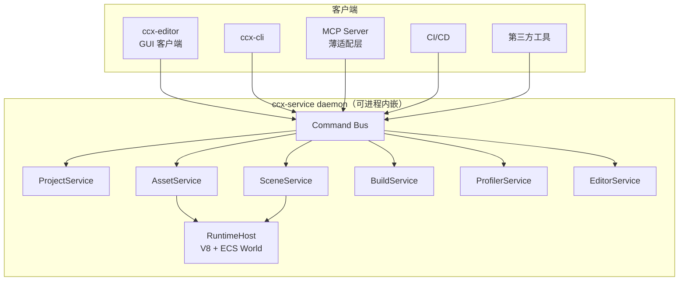

# services-spec — 服务层规格（Service API / Command Bus / MCP / Editor 边界）

> 配套：ADR-006 · 依赖：asset-spec、engine-spec、platform-spec
> **v0.2**：2D-first 收敛（无 3D 相关方法/字段）

---

## 1. 拓扑



- 部署形态三选一（客户端无感知）：**进程内嵌**（编辑器单进程）、**同机 daemon**（stdio/WebSocket/named pipe）、**远端 daemon**（M4+，云构建服务）。
- 传输：JSON-RPC 2.0；方法名 `<service>.<method>[@vN]`；事件 = 服务端 notification。
- 大负载（纹理/顶点数据字节）永远走**文件引用**，不走 RPC（asset-spec artifact 约定）。

## 2. Service API 目录（v1 全量）

### ProjectService
```json
project.open     { path } -> { project, version }
project.create   { path, type: "2d", template? } -> { project }   // v0.2：只提供 2d
project.status   {} -> { open, dirty, lastSavedAt }
project.close    {} -> {}
project.config.get { key? } / project.config.set { key, value }
```

### AssetService（asset-spec §3 契约）
```json
asset.scan        {} -> { scanned, changed }
asset.list        { filter? } -> { assets: [{uuid,type,path,status}] }
asset.find        { query: {type?, path?, tag?} } -> { assets }
asset.import      { path } -> { uuid }
asset.reimport    { uuids[] } -> { results[] }          // 幂等；任务队列
asset.delete      { uuids[] } -> { deleted }
asset.update_params { uuid, params } -> { uuid }
asset.resolve     { uuid, sub? , type? } -> { runtimeRef }
asset.report_status {} -> { failed: [...] }
asset.make_preview { uuids[] } -> { previews: [{uuid, png}] }   // headless 出图
```

### SceneService（Command Bus 之上的读写）
```json
scene.open       { path } -> { sceneId, entities: n }
scene.save       { sceneId, path? } -> { savedAt }
scene.query      { sceneId, filter: {type?, name?, parent?, component?} } -> { entities: [entityView] }
scene.get_entity { sceneId, entity } -> { name, parent, components: [ {type, data} ] }
scene.apply      { sceneId, commands: [command] }    // 唯一写入口（§4）
scene.undo       { sceneId, n? }
scene.redo       { sceneId, n? }
scene.instantiate_prefab { sceneId, uuid, at? } -> { entity }
scene.preview    { sceneId } -> { png, camera }       // headless 渲染截图
scene.systems    { sceneId } -> { systems: [...] }
```

### BuildService（ADR-006 与 cocos-cli 兼容）
```json
build.configure { platform, options? } -> { profileId }
build.run       { profileId?, stage? } -> { jobId }
build.cancel    { jobId }
build.progress  { jobId } -> { stage, percent, logs[] }   // + 事件推送
build.artifacts { jobId } -> { path, manifest }
build.platforms {} -> [ { id, displayName, requiredOptions[] } ]  // 扫描 builder 插件
```

### ProfilerService
```json
profiler.start { targets: ["frame","render","physics","script"] } -> {}
profiler.snapshot {} -> { frame, cpu, gpu, drawcalls, entities, alloc }
profiler.stop {}
```

### EditorService（仅编辑器会话内有效）
```json
editor.open_window { panel } / editor.focus { panel }
editor.set_theme / editor.shortcut.list / editor.shell.state {}
```

## 3. 事件（服务端 notification）

```json
{ "event": "assetChanged",  "data": { "uuid": "...", "change": "modified" } }
{ "event": "sceneInvalidated", "data": { "sceneId": "...", "entities": [3, 7] } }
{ "event": "commandApplied", "data": { "seq": 42, "command": { ... } } }
{ "event": "buildProgress",  "data": { "jobId": "...", "stage": "bundle", "percent": 0.63 } }
{ "event": "previewReady",   "data": { "sceneId": "...", "png": "file://..." } }
```

- 客户端断线重连：`resync` 方法（asset.scan + scene.query 全量），事件序号可断点续传（服务端环形缓冲 10k）。

## 4. Command Bus（铁律 12 落点）

- 定义：`\{ op, args, undo?, meta \{ by: "user|ai|script|cli", at, seq } \}`
- v1 命令集（场景写路径全量）：
  `create_entity / destroy_entity / clone_entity / set_parent / set_name`
  `add_component / remove_component / set_property (path) / reset_property`
  `instantiate_prefab / apply_prefab_override / revert_override`
  `import_asset / delete_asset / set_asset_params`
  `material.set_parameter / material.set_shader`
  `build.configure / build.run`
- 语义：每个命令 = 幂等可回放（undo 由逆命令或快照段支撑）；**apply 失败必须回滚到命令前状态**（ADR-006 §6）。
- 审计日志：`~/.ccx/logs/command.log`（JSONL）；AI 会话的每条命令都带 `by:"ai"` 与指导 prompt 引用，可复盘。

## 5. Inspector 生成（原方案 §13 落地）

- InspectorPanel 订阅 `scene.get_entity` + 组件 schema（TypeRegistry JSON Schema）→ 渲染表单。
- 自定义控件 = 插件注册 `inspectorProviders`（按 typeId 覆盖）；第三方组件零代码获得默认表单。
- 无"Inspector 硬编码组件类型"路径：新增组件类型只产生 schema，不产生代码。

## 6. CLI 命令面（cocos-cli 兼容 + CCX 扩展）

| 命令 | 转调服务 | 兼容性 |
| --- | --- | --- |
| `create` | project.create | ✅ cocos-cli 同名 |
| `build` | build.configure+run（--platform/--stage 原样） | ✅ |
| `start-mcp-server` | MCP 适配层启动器（--port） | ✅（原样保留入口） |
| `wizard` | editor 快捷面板 | ✅ |
| `pack` | build 产物打包 | ✅ |
| `asset import / asset list / asset reimport` | AssetService | ➕ CCX 新增 |
| `scene new / scene query / scene apply` | SceneService | ➕ CCX 新增（AI 首选入口） |
| `profiler snapshot` | ProfilerService | ➕ |
| `service start/stop/status` | daemon 管理 | ➕ |
| `upgrade` / `doctor` | 版本检查/环境诊断 | ➕ |

全局 `--no-interactive` 保留（CI 场景）；命令输出默认 JSON（`--json`），人类可读表格为默认展示层。

## 7. MCP 映射（AI 接口）

- MCP 工具 = 服务方法的声明式映射（生成器产出）：`build.configure → mcp 工具 build_configure`，描述/参数 schema 自动生成。
- 关键编排示例（原方案 §20 剧情落地）：

```text
create_project → asset.import(sprites/atlas) → scene.open →
scene.apply(create_entity × n) → scene.apply(add_component PlayerController) →
scene.apply(set_property ...) → scene.preview(capture png) → build.run → 完成
（AI 生成 2D 精灵/UI 场景的完整闭环，services-spec §7）
```

- 官方 MCP servers：`ccx-mcp`（项目/scene/asset/build，不依赖编辑器进程）+ `ccx-editor-mcp`（需编辑器，暴露 EditorService + 快捷键/面板）。
- **禁止** execute_javascript 风格"编辑器后门"（ADR-006 §7）；AI 的能力 = 服务能力的并集，不多不少。

## 8. Editor 边界（原方案 §11/21/22 落地）

- Editor = Shell + 插件；Shell 提供 workspace/docking/command 面板/快捷键/选择/撤销栈/通知/扩展宿主。
- 插件贡献点（VS Code 级，与 cocos-cli contributes 对齐的扩展面）：

```json
{ "contributes": {
    "commands": [], "panels": [], "inspectors": [], "assetTypes": [],
    "importers": [], "builders": [], "menus": [], "shortcuts": [],
    "projectServices": [], "mcpServers": [], "sceneTools": []
} }
```

- 布局：Web UI（TS/React shell）+ 本地 daemon；`ccx-editor` 官方插件集 = scene/inspector/hierarchy/asset browser/animation/timeline/material/shader/vfx2d(粒子/基础)/tilemap(基础)/ui/profiler/diagnostics。
- "没有内置面板，全是插件" = Shell 不含业务面板；官方面板以官方插件分发（可装卸）。

## 9. 明确不做

- 不做云端多用户协作（M5 评审）；不做可视化 No-Code 编辑器（M4+ 评审）；不做"编辑器中自有脚本解释器"（脚本=项目代码，ADR-004）。
